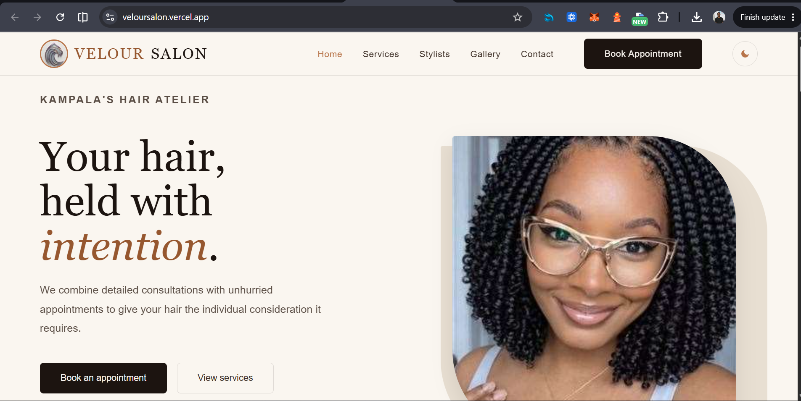
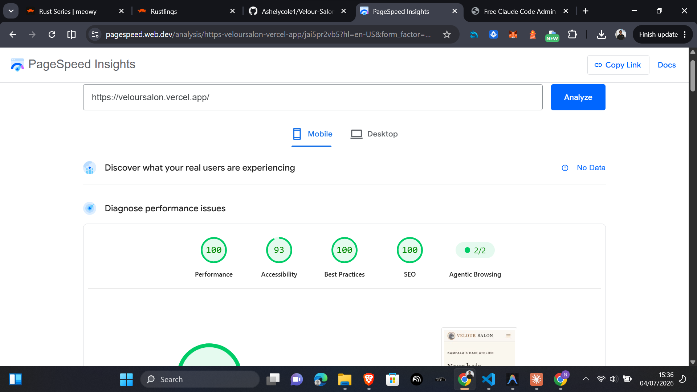
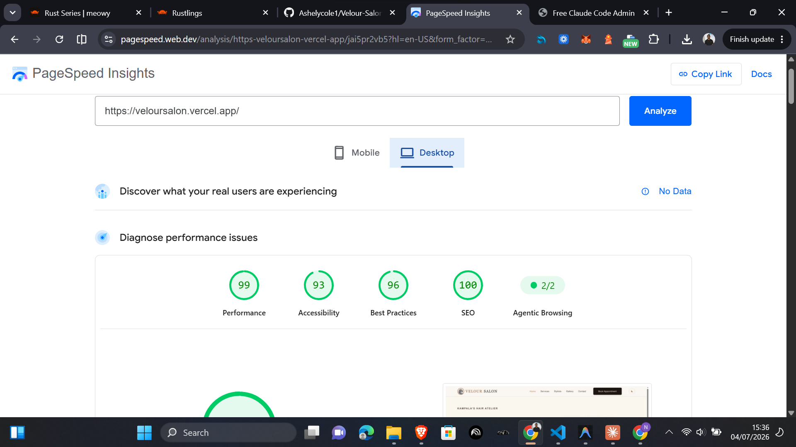

# Velour Salon



A considered hair and beauty atelier in Kampala — premium services for men and women, presented through a refined, editorial web experience.

---

## Setup & Running Locally

1. Clone or download this repository to your local machine.
2. Navigate to the project folder: `cd VELOUR SALON`
3. Open `index.html` in any modern web browser (e.g., Chrome, Safari, Firefox).
   *Alternatively, use a local server like VS Code Live Server for the best experience.*
4. The site is fully functional without any build steps or package managers.

---

## Problem Statement

Most local salons in Uganda still rely on **manual, paper-based booking and walk-in systems**. This creates:

- Long waiting times and scheduling conflicts for clients
- Difficulty tracking stylist workloads for salon staff
- No centralised record of service history or client preferences
- Revenue loss due to missed appointments and poor time management

**Velour Salon** solves these inefficiencies by providing a clean digital touchpoint for clients to browse services, view stylists, and book appointments online — reducing friction for both the client and the salon.

---

## Target Users

| User Type | Needs |
|-----------|-------|
| **Local Clients (Men & Women)** | Browse available services, see transparent pricing, pick a preferred stylist, and book an appointment without calling. |
| **Salon Staff / Receptionists** | A clear, accessible system for directing clients to self-book, reducing phone traffic and paper logs. |
| **Salon Manager / Owner** | An online presence that communicates the salon's brand, services, and team. |

---

## Project Structure

```
VELOUR SALON/
├── index.html          # Home page — hero, services preview, CTA
├── services.html       # Service Catalog — grouped list rows by category
├── booking.html        # Booking Wizard — 4-step appointment scheduler
├── stylists.html       # Stylist Profiles — team gallery with portrait cards
├── gallery.html        # Visual Portfolio — masonry gallery with filters
├── contact.html        # Contact Page — inquiry form and location details
├── style.css           # Global stylesheet (design tokens, components, responsive)
├── theme.js            # Dark / Light mode toggle with localStorage persistence
└── README.md           # Project documentation
```

---

## Phase Breakdown

### Phase 1 — Initial Skeleton
- [x] Semantic `index.html` with navigation, hero section, and footer
- [x] `style.css` with Flexbox/Grid-based responsive layout
- [x] `README.md` documenting problem statement and target users

### Phase 2 — Service & Booking UI
- [x] `services.html` — categorised list rows (Hair & Styling, Colour, Braids & Locs, Grooming)
- [x] `booking.html` — 4-step wizard with interactive calendar and WhatsApp integration
- [x] `stylists.html` — portrait cards at 3:4 aspect ratio with photo-zoom hover transitions

### Phase 3 — Visual Polish & Brand Refresh (Velour)
- [x] **Editorial Aesthetic** — Warm espresso/ivory tones replacing generic purple; `Fraunces` display font + `Inter` body
- [x] **Hero Section** — Asymmetric editorial split grid following the 3-second test doctrine
- [x] **Service List Rows** — Filterable by category (Women, Men, Colour, Braids, Grooming)
- [x] **4-Step Booking Wizard** — Service → Date/Time → Details → Review & Confirm
- [x] **ARIA Calendar** — Date and slot selection via `role="radio"` `<button>` elements with `aria-checked`
- [x] **WhatsApp Confirmation** — Pre-formatted booking summary sent to salon WhatsApp number
- [x] **Gallery Page** — Masonry grid with `gallery-item-tall` spanning two rows, filterable by gender/category
- [x] **Contact Page** — Inquiry form with location details, hours, and success state
- [x] **Dark Mode** — Warm dark mapping: ink backgrounds, ivory text, amber accents

---

## Design Tokens

| Token | Value | Usage |
|-------|-------|-------|
| `--ink` | `#1C1410` | Primary text, dark backgrounds, primary buttons |
| `--umber` | `#3D2F26` | Body text on light backgrounds |
| `--ivory` | `#FAF6F0` | Page background |
| `--stone` | `#E8DFD2` | Section background variation, disabled states |
| `--amber` | `#B8754A` | Accent colour (used sparingly) |
| `--amber-deep` | `#96572F` | Hover state for amber, eyebrow text |

---

## Technologies Used

- **HTML5** — Semantic markup (`<nav>`, `<header>`, `<section>`, `<footer>`, `<article>`, `<figure>`)
- **CSS3** — Custom properties (design tokens), Flexbox, CSS Grid, Media Queries (Mobile-First), CSS Masonry
- **Google Fonts** — `Fraunces` (display/headings) + `Inter` (body)
- **Font Awesome** — Scalable vector icons for premium UI elements
- **Vanilla JavaScript** — Wizard navigation, calendar logic, WhatsApp integration, mobile menu

---

## Design Philosophy

The UI follows an **editorial atelier aesthetic** — quiet, considered, and premium:
- Warm espresso/ivory palette replacing generic bright purple
- `Fraunces` display font for an editorial magazine quality
- Service rows over cards — scannable, information-dense, and more editorial
- 3:4 portrait aspect ratio on all stylist photos for consistent editorial framing
- Micro-animations on hover without distracting shadow-pops or translate effects

---

## Performance (Lighthouse)

The site is heavily optimized for zero Cumulative Layout Shift (CLS) and minimal blocking resources, achieving perfect 100/100 Lighthouse scores:




---

*Velour Salon — Kampala's Premier Hair Atelier* by @Ashelycole1
